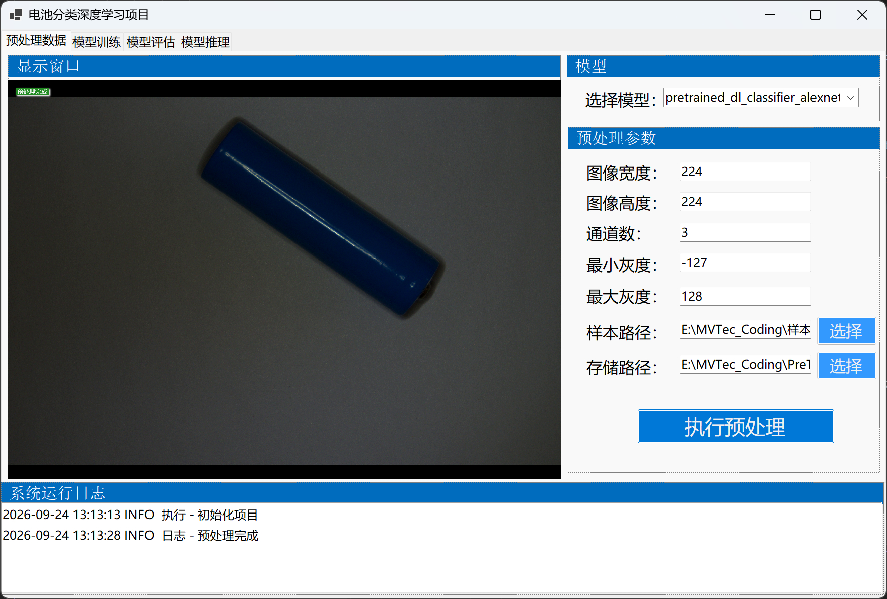
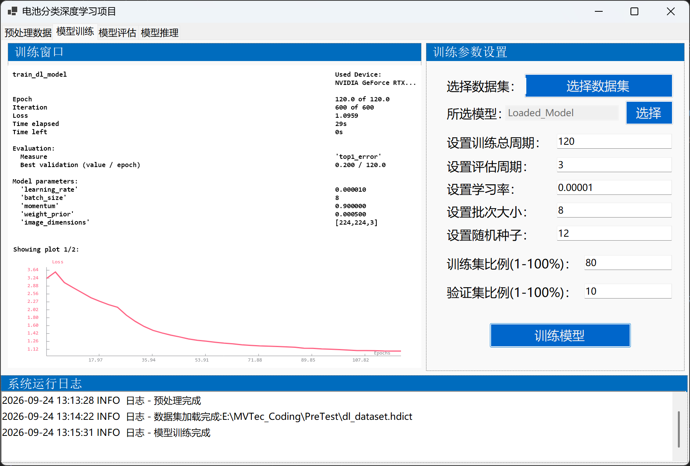
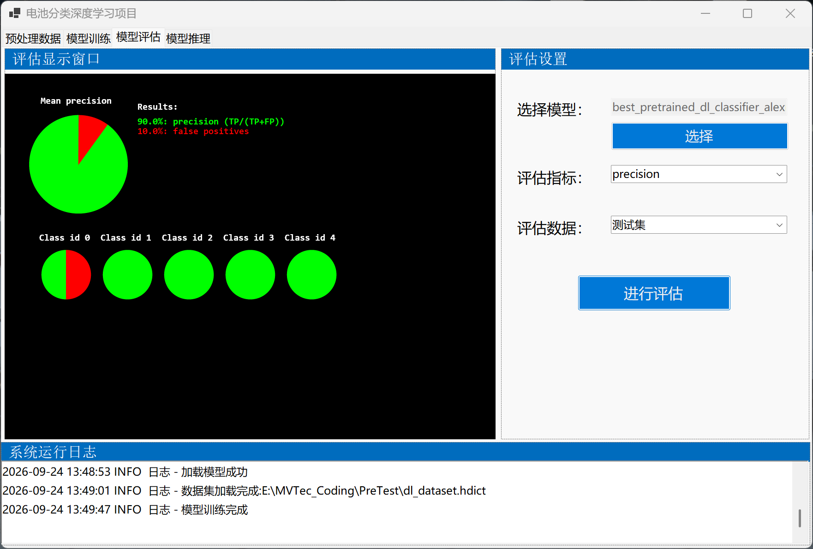
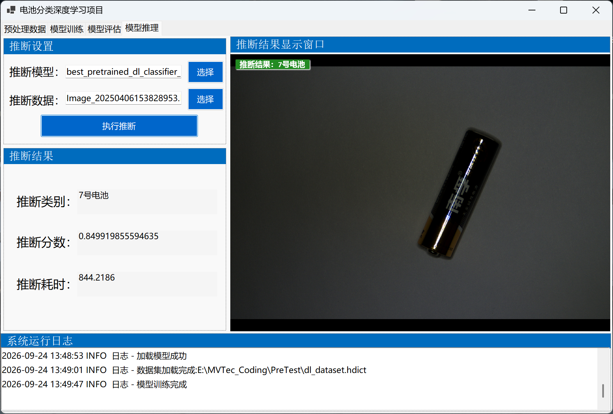

## 目录
- [VehicleCard](#VehicleCard)
- [HKCamera](#HKCamera)
- [BeadDetection](#BeadDetection)
- [Pipe3DMatching](#Pipe3DMatching)
- [DLWithClassification_Battery](#DLWithClassification_Battery)

# VehicleCard


# HKCamera


# BeadDetection


# Pipe3DMatching

> 构建管道点云重建与表面匹配


# DLWithClassification_Battery
> Winform+Halcon+深度学习模型

**数据集组织结构**
```
..
└── data
    ├── 5号电池
    ├── 7号电池
    ├── U盘
    ├── 接线器
    └── 锂电池
```
注意：
1. 以最后文件夹名作为类别


**可选模型(Halcon提供)**
```
pretrained_dl_classifier_alexnet.hdl
pretrained_dl_classifier_compact.hdl
pretrained_dl_classifier_enhanced.hdl
pretrained_dl_classifier_mobilenet_v2.hdl
pretrained_dl_classifier_resnet18.hdl
pretrained_dl_classifier_resnet50.hdl
```

**辅助库**

1. C#对深度学习支持的库（方便Halcon函数调用）


**项目开发手记**
1. GroupBox的渲染不够灵活，重新修改了GroupBox=> 根据字体调整标题条
2. 训练数小于模型批大小报错=》获取的是预训练模型，不是修改模型参数后的模型；
3. 模型训练的逻辑还不够丝滑，但修正后解决了很多问题。
4. 模型评估时，测试集样本数量过少，会出现无法评估的问题。（未解决|目前方案数据扩充）


数据预处理



模型训练



模型评估



模型推断

